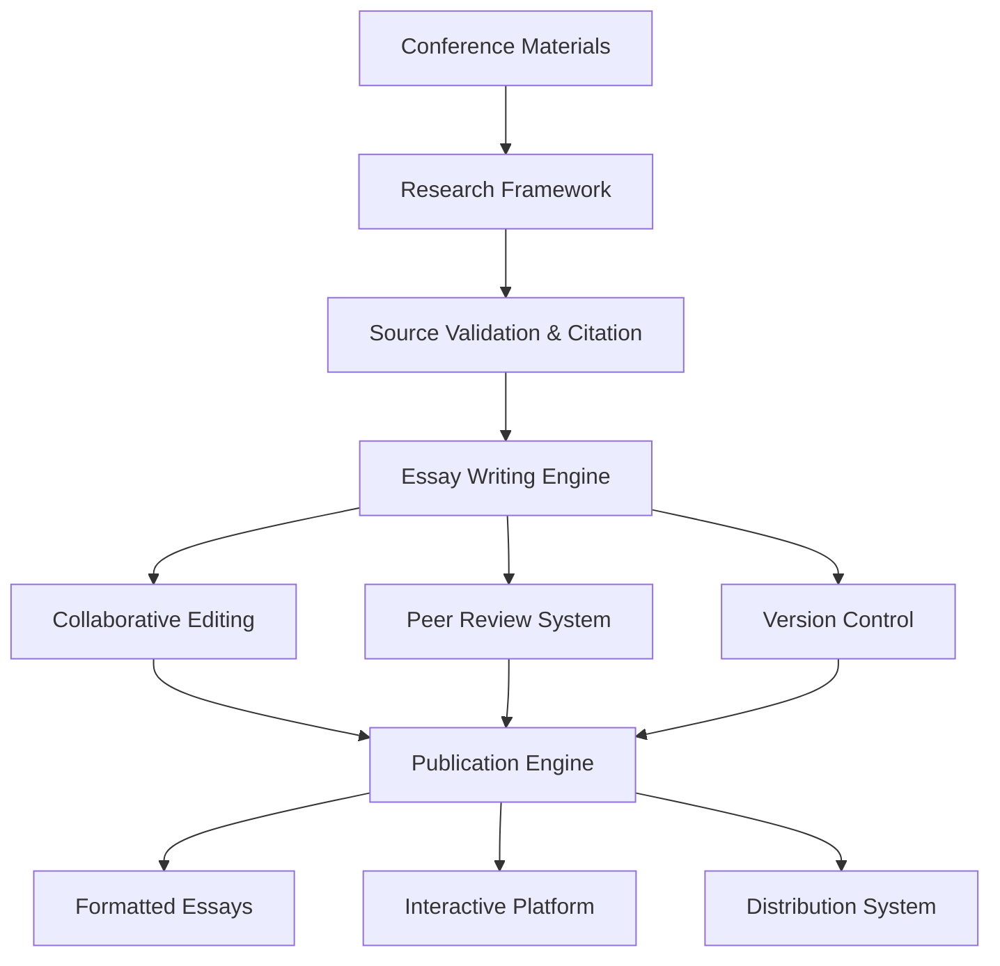

# 🏗️ Project Architecture - AIM Agency 2025 Essay Platform

> **Purpose**: Comprehensive overview of the three-phase architecture for collaborative essay writing and investigation platform

## **🎯 System Overview**

The AIM Agency 2025 Essay & Investigation Platform follows a **three-phase architecture** designed for both functionality and pedagogical clarity:

## **📝 Phase 1: Foundation & Research Framework**

**Objective**: Establish ethical research methodology and writing infrastructure for AI governance essays

### **Core Components**
- **Research Framework** (`scripts/research-framework.R`)
  - Source validation and ethical compliance checking
  - Citation management with APA formatting
  - Research progress tracking and logging

- **Essay Templates** (`scripts/templates/`)
  - Structured R Markdown templates for academic writing
  - Consistent formatting and metadata tracking
  - Collaborative authorship documentation

- **Ethical Guidelines** (`docs/ethics-guidelines.md`)
  - Academic integrity and source attribution standards
  - Participant consent and privacy protection
  - Quality assurance and peer review processes

### **Technical Stack**
- **Language**: R (primary), R Markdown for document generation
- **Data Storage**: RDS for research logs, CSV for source databases
- **Version Control**: Git for collaborative writing workflows
- **Templates**: R Markdown with custom CSS/styling

### **Deliverables (Issue #2)**
- [ ] Essay template system with metadata tracking
- [ ] Research framework with source validation
- [ ] Citation management and APA formatting
- [ ] Collaborative writing workflow documentation

## **🧠 Phase 2: Content Creation & Analysis**

**Objective**: Transform research into high-quality essays through collaborative writing and analytical frameworks

### **Core Components**
- **Collaborative Writing System**
  - Version control integration for multi-author essays
  - Peer review workflows with structured feedback
  - Conflict resolution and consensus-building tools

- **Thematic Analysis Framework** 
  - AI governance themes (policy, ethics, implementation)
  - Conference topic categorization (agency, infrastructure, collaboration)
  - Cross-theme analysis and synthesis tools

- **Quality Assurance System**
  - Automated citation validation
  - Plagiarism detection and originality checking
  - Fact-checking workflows and source verification

### **Technical Stack**
- **Writing Tools**: R Markdown, Quarto, collaborative editing
- **Analysis**: tidytext, quanteda, thematic analysis packages
- **Validation**: Academic integrity tools, citation validators

### **Deliverables (Issues #3-4)**
- [ ] Collaborative writing infrastructure
- [ ] Thematic analysis and categorization system
- [ ] Peer review and feedback mechanisms
- [ ] Quality assurance and validation workflows

## **📈 Phase 3: Publication & Dissemination**

**Objective**: Generate publication-ready essays with interactive features and broad accessibility

### **Core Components**
- **Publication Engine**
  - Multi-format output (HTML, PDF, EPUB)
  - Academic formatting with proper citations
  - Automated cross-referencing and indexing
  - Version control and change tracking

- **Interactive Platform**
  - Web-based reading interface
  - Commenting and discussion systems
  - Reader feedback and engagement metrics
  - Social sharing and distribution tools

- **Accessibility & Distribution**
  - Mobile-responsive design
  - Screen reader compatibility
  - Multiple language support (future enhancement)
  - Open access publishing with proper licensing

### **Technical Stack**
- **Publishing**: bookdown, quarto-pub, Jekyll/Hugo
- **Platform**: Shiny, blogdown, GitHub Pages
- **Distribution**: RSS feeds, email newsletters, social media integration
- **Analytics**: Reader engagement tracking, feedback analysis

### **Deliverables (Issues #5-6)**
- [ ] Automated publication engine with formatting
- [ ] Interactive web platform for essay reading
- [ ] Reader engagement and commenting system
- [ ] Distribution and accessibility infrastructure

## **🔗 Integration & Content Flow**

### **Writing Pipeline**
1. **Research** → Source validation and citation management
2. **Drafting** → Collaborative writing with version control
3. **Review** → Peer feedback and quality assurance
4. **Publication** → Multi-format output and distribution

### **Quality Assurance**
- **Ethics Review**: Compliance with research ethics guidelines
- **Fact Checking**: Source verification and accuracy validation
- **Peer Review**: Structured feedback from collaborators
- **Editorial Oversight**: Final quality and style consistency

## **⚙️ Configuration & Deployment**

### **Environment Setup**
- **R Environment**: renv for package management
- **Dependencies**: Documented in `config.yml` and installation scripts
- **Templates**: Standardized essay and analysis templates
- **Workflows**: Git-based collaboration and review processes

### **Scalability Considerations**
- **Modular Design**: Each phase operates independently
- **Configurable Templates**: Easy customization for different essay types
- **Collaborative Features**: Support for multiple simultaneous projects
- **Publication Flexibility**: Multiple output formats and distribution channels

---

## **🎓 Learning Outcomes**

After implementing this architecture, contributors will understand:
- **Ethical research practices** for academic writing and source validation
- **Collaborative writing workflows** using version control and peer review  
- **Publication systems** for multi-format academic content distribution
- **Quality assurance processes** for maintaining academic integrity
- **Open science practices** for transparent, reproducible scholarship

---

**Each phase builds on the previous, creating a comprehensive platform that's both functional and educational.**