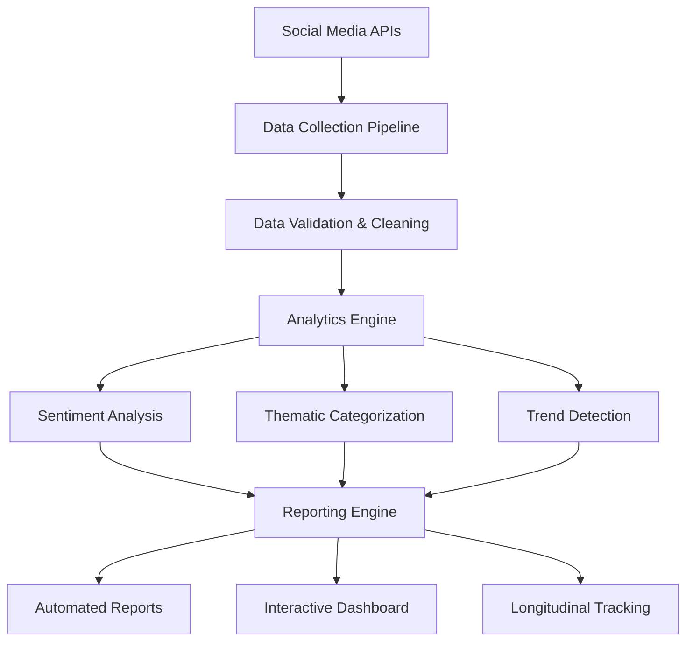

# 🏗️ Technical Architecture - AIM Agency 2025

> **Purpose**: Comprehensive overview of the three-phase technical architecture for monitoring AI community event impact

## **🎯 System Overview**

The AIM Agency 2025 Impact Monitoring System follows a **three-phase architecture** designed for both functionality and pedagogical clarity:

## **📊 Phase 1: Foundation & Data Collection**

**Objective**: Establish ethical, automated data collection from public social media sources

### **Core Components**
- **Social Media Scrapers** (LinkedIn, X/Twitter)
  - Rate-limited API calls respecting platform policies
  - Configurable search parameters for event-related content
  - Robust error handling and retry mechanisms

- **Data Validation Pipeline**
  - Input sanitization and format standardization
  - Duplicate detection and removal
  - Data quality scoring and flagging

- **Ethical Framework**
  - Public-only content collection
  - Privacy-preserving data handling
  - Compliance with platform terms of service

### **Technical Stack**
- **Language**: R (primary), Python (scraping utilities)
- **Data Storage**: CSV/Parquet for processed data, JSON for raw feeds
- **APIs**: LinkedIn API, Twitter API v2, custom scrapers
- **Scheduling**: Cron jobs for regular collection intervals

### **Deliverables (Issue #2)**
- [ ] LinkedIn scraping module with ethical guidelines
- [ ] Twitter/X scraping infrastructure  
- [ ] Data validation and cleaning pipeline
- [ ] Rate limiting and error handling framework

## **🧠 Phase 2: Analytics Engine**

**Objective**: Transform raw social media data into meaningful insights about AI community impact

### **Core Components**
- **Sentiment Analysis System**
  - Multi-model approach (VADER, TextBlob, transformer models)
  - Domain-specific tuning for AI/government terminology
  - Confidence scoring and uncertainty quantification

- **Thematic Categorization** 
  - AI adoption themes (government, public service, innovation)
  - Event impact categories (networking, knowledge transfer, policy)
  - Automated tagging with manual validation

- **Trend Detection Algorithms**
  - Time-series analysis for conversation evolution
  - Spike detection for viral content identification
  - Influence network mapping

### **Technical Stack**
- **ML Libraries**: tidytext, sentiment, word2vec, transformers
- **Statistics**: forecast, changepoint, igraph
- **Validation**: Cross-validation, human annotation benchmarks

### **Deliverables (Issues #3-4)**
- [ ] Multi-model sentiment analysis pipeline
- [ ] Thematic classification system
- [ ] Trend detection and alert mechanisms
- [ ] Longitudinal tracking infrastructure

## **📈 Phase 3: Reporting & Visualization**

**Objective**: Generate automated, actionable insights through reports and interactive dashboards

### **Core Components**
- **Automated Report Generation**
  - Daily sentiment summaries
  - Weekly trend analysis reports  
  - Monthly longitudinal impact assessments
  - Custom report templates for stakeholders

- **Interactive Dashboards**
  - Real-time sentiment monitoring
  - Thematic evolution visualization
  - Geographic impact mapping (Alberta focus)
  - Comparative event analysis

- **Longitudinal Impact Visualization**
  - Pre/during/post event impact tracking
  - Conversation lifecycle analysis
  - Influence propagation visualization

### **Technical Stack**
- **Reporting**: R Markdown, Quarto, automated scheduling
- **Visualization**: ggplot2, plotly, D3.js integration
- **Dashboards**: Shiny, flexdashboard, Observable
- **Distribution**: GitHub Pages, automated email delivery

### **Deliverables (Issues #5-6)**
- [ ] Automated reporting engine with templates
- [ ] Interactive dashboard for real-time monitoring
- [ ] Longitudinal visualization framework
- [ ] Stakeholder communication system

## **🔗 Integration & Data Flow**

### **Data Pipeline**
1. **Collection** → Raw social media posts (JSON)
2. **Validation** → Cleaned, standardized data (CSV/Parquet)
3. **Analytics** → Enriched data with sentiment/themes (R data frames)
4. **Reporting** → Aggregated insights (Reports, dashboards)

### **Quality Assurance**
- **Testing**: Unit tests for each pipeline component
- **Validation**: Human annotation for model performance
- **Monitoring**: Automated alerts for data quality issues
- **Documentation**: Comprehensive logging and audit trails

## **⚙️ Configuration & Deployment**

### **Environment Setup**
- **R Environment**: renv for package management
- **Dependencies**: Documented in `config.yml` and installation scripts
- **Secrets Management**: Environment variables for API keys
- **Scheduling**: Cron/systemd for automated execution

### **Scalability Considerations**
- **Modular Design**: Each phase operates independently
- **Configurable Parameters**: Easy adjustment of collection/analysis settings
- **Performance Monitoring**: Resource usage tracking and optimization
- **Error Recovery**: Robust failure handling and restart mechanisms

---

## **🎓 Learning Outcomes**

After implementing this architecture, contributors will understand:
- **Ethical data collection** practices for social media research
- **Scalable analytics pipelines** for text analysis and sentiment monitoring  
- **Automated reporting systems** for stakeholder communication
- **Real-time monitoring** approaches for evolving conversations
- **Open science practices** for reproducible research

---

**Each phase builds on the previous, creating a comprehensive system that's both functional and educational.**